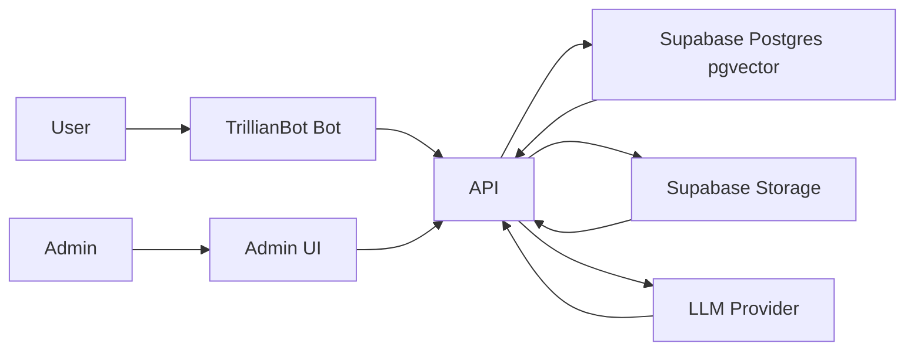

iChat AI Assistant MVP

# Executive Summary
- Objective: Reduce managerial time spent on routine Q&amp;A by deploying an internal AI chat agent that answers employee questions from curated company documentation. 
- Outcome: Faster, consistent answers; centralized knowledge; scalable onboarding; measurable time savings for managers.
- Delivery: 6-week MVP, leveraging managed services and modern JavaScript stack to accelerate time to value.
- Investment: $39-49k one-time development; $200/month infra; Bryce for maintenance.

---
# Business Case at a Glance
- Problem: Managers spend 15-20% of time on repetitive Q&amp;A; inconsistent answers; fragmented knowledge.
- Value Drivers:
  - Reduce managerial workload; free managers for high-value work
  - Improve employee productivity via instant, consistent answers
  - Capture institutional knowledge; strengthen onboarding and compliance
- Quantified Impact (from current state):
  - 5 managers × 3 hrs/week × $75/hr = $1,125/week opportunity cost; $58,500/year

---
# MVP Scope Summary
- MVP (delivered in 6 weeks):
  - Document upload, text extraction, chunking, semantic search
  - Admin interface for document and user management
  - Authentication and security via Supabase Auth and RLS
  - Logging, monitoring, and basic prompt engineering
  - Trillian bot integration for conversational access

---
# POST MVP Roadmap
- Post-MVP Roadmap:
  - Escalation workflow and human-in-the-loop learning
  - Web chat interface?
  - CLI administration tool
  - Advanced analytics and dashboards
  - Document versioning and audit trail
  - Enhanced security and compliance controls
  - Multi-turn context management and automated confidence scoring

---
# Timeline and Key Milestones
- Week 1–1.5: Supabase foundation, auth, database schema, storage, API skeleton
- Week 2–3: AI chat integration, real-time messaging, session management, prompt design
- Week 4: RAG: embeddings, similarity search, document Q&amp;A
- Week 5–6: React admin interface, end-to-end integration, security validation, integration tests
- Week 8: Deployment, configuration, monitoring, documentation, E2E testing

---
# Success Metrics and Acceptance Criteria
- Usage and performance:
  - 5–10 concurrent users; avg response time under 10 seconds
  - 20–30 daily queries across users in pilot
- Quality:
  - 90%+ accuracy for document-based FAQ queries
  - 80%+ positive user feedback on response helpfulness
- Business impact:
  - 2–3 hours/week manager time saved per person in pilot
  - 25% faster information retrieval by employees
- Acceptance (MVP):
  - Chat answers grounded in uploaded docs with cited sources
  - Admins can upload and manage documents
  - Deployed, monitored, documented; security validated

---
# Cost Estimates
- One-time development: $40-50k (MVP)
- Recurring:
  - Infra: ~$200/month (actuals may vary by usage)
  - Maintenance and minor enhancements: Bryce
  - LLM/RAG usage: pay-per-use; monitored and capped; start with conservative limits
- Optional add-ons (post-MVP priced separately):
  - Escalation workflow, CLI, analytics dashboards, advanced compliance

---
# Assumptions and Dependencies
- Initial corpus: ~200 documents available for upload and curation
- English only; sensitive data handled per policy and role permissions
- 5–10 concurrent users; pilot team participation and feedback
- Access to OAuth2 identity provider
- No datasources, only document upload for MVP
- No need to support images in RAG
- Assume cloud deploy

---
# Questions for Clarification
- What document types required? Are there any images?
- Any legally questionable areas we need to plan to handle?
- Can we get your top 10 frequently asked questions and use those to create an evaluation framework?
- 5 cents per query, $50 for 1000 pages?
- Possible to skip oauth2 for admin ui?

---
# Technical Risks
- **AI Response Quality**: Mitigation through careful prompt engineering and testing
- **System Reliability**: Mitigated by Supabase managed infrastructure
- **Data Security**: Addressed through OAuth2 and row-level security policies

---
# Business Risks
- **User Adoption**: Mitigated by leveraging existing workflows and training
- **Response Quality**: Requires ongoing document curation and updates
- **Scope Creep**: Managed through clear MVP boundaries and post-MVP roadmap
- **MVP to Prod Quality**: Requires ongoing tuning, curation, and updates

---
# Implementation and Change Management
- Pilot-first rollout: 10–20 pilot users; collect weekly feedback to refine prompts and KB
- Training and enablement: 60–90 minute onboarding; quick-reference materials; admin training
- Content operations: Document owners; monthly KB review cadence; governance and curation workflow
- Support: Incident response playbook; log monitoring; usage dashboards

---
# Why This Approach Wins
- Fast time-to-value:
  - Supabase managed services reduce build time by ~19–24% vs. custom infra
- Flexibility:
  - Pluggable LLM providers; scalable data architecture; API-first design
- Pragmatic scope:
  - High-impact core features first; clear path to human-in-the-loop and Trillian Bot
- Measurable ROI:
  - Break-even in 10–15 months with realistic adoption; upside with broader rollout

---
# Decision and Next Steps
- Approvals requested:
  - MVP budget: $40-50k
  - 8-week schedule with milestone acceptance gates
  - Pilot user group and document collection kickoff
- Immediate actions:
  - Day 0–3: Confirm identity provider options, provision Supabase project, begin doc intake
  - Week 1: Baseline dashboards for usage and feedback metrics
  - Week 2: Pilot communications and training plan ready

---
# Technical Approach
- Architecture:
  - Frontend: React web app (user chat, admin interface)
  - Backend: ASP.NET Core API
  - Data: Supabase Postgres with pgvector; Supabase Storage for files
  - LLM: OpenAI initially, with abstraction to support Anthropic or others
  - Auth: Supabase Auth (OAuth2) with RLS for data security
- Core RAG flow:
  - Upload docs → extract text → chunk → embed with OpenAI → store vectors in pgvector
  - Query → retrieve relevant chunks → craft prompt → generate grounded answer with citations

---
# Architecture Diagram
- Diagram outlines data flow and major components.

