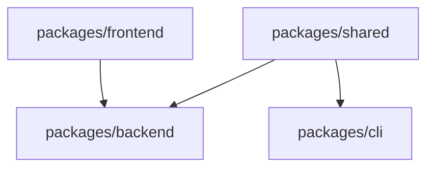

a# Technical Stack Specifications

## Overview

This document provides detailed technical specifications for the AI-powered internal chat agent system, leveraging Supabase for managed database, authentication, real-time features, and storage, with a modern full-stack JavaScript/TypeScript architecture using Bun, Vite, React, Hono, and tRPC.

## Backend Architecture

### Project Structure

- **Monorepo**: Single repository with packages for backend and frontend
- **Backend Package**: `packages/backend` - Hono API server with tRPC procedures
- **Frontend Package**: `packages/frontend` - React web application
- **Shared Package**: `packages/shared` - Common types and utilities
- **CLI Package**: `packages/cli` - Command-line interface for administration

### Project Dependencies



### API Architecture

- **Primary Backend**: Hono with tRPC for type-safe API procedures
- **Supabase Integration**: Direct client integration for database and real-time features
- **API Design**: tRPC procedures + Supabase REST API + Supabase Realtime

### Core Framework

- **Runtime**: Bun (fast JavaScript runtime)
- **Language**: TypeScript
- **Web Framework**: Hono for backend API
- **API Framework**: tRPC for type-safe procedures
- **Supabase SDK**: Official Supabase JavaScript client

### Key Dependencies

#### packages/shared

```json
{
  "name": "@ichat/shared",
  "dependencies": {
    "zod": "^3.22.0"
  }
}
```

#### packages/backend

```json
{
  "name": "@ichat/backend",
  "dependencies": {
    "@hono/zod-validator": "^0.1.0",
    "@supabase/supabase-js": "^2.39.0",
    "@trpc/server": "^10.45.0",
    "hono": "^4.0.0",
    "openai": "^4.0.0",
    "langchain": "^0.1.0",
    "zod": "^3.22.0"
  }
}
```

#### packages/cli

```json
{
  "name": "@ichat/cli",
  "dependencies": {
    "@supabase/supabase-js": "^2.39.0",
    "commander": "^11.0.0",
    "zod": "^3.22.0"
  }
}
```

### Authentication & Security

- **Supabase Auth**: Built-in OAuth2 with company identity provider integration
- **JWT Tokens**: Supabase-managed JWT tokens for session management
- **API Keys**: Supabase API keys for backend authentication
- **Row Level Security**: Supabase RLS policies for data access control
- **Input Validation**: Zod schemas for type-safe validation

## Database Architecture

### Primary Database

- **Platform**: Supabase PostgreSQL 15+ with pgvector
- **Vector Extension**: pgvector pre-configured for embeddings storage
- **Client**: Supabase JavaScript client for database operations
- **Hybrid Approach**: Direct client queries for simple operations, tRPC procedures for complex logic
- **Auto-generated APIs**: PostgREST for automatic REST API generation

### Key Database Packages

#### packages/shared (Type Definitions)

```json
{
  "name": "@ichat/shared",
  "dependencies": {
    "zod": "^3.22.0"
  }
}
```

#### packages/backend (Database Client)

```json
{
  "name": "@ichat/backend",
  "dependencies": {
    "@supabase/supabase-js": "^2.39.0",
    "zod": "^3.22.0"
  }
}
```

### Database Schema Design (packages/shared)

```typescript
// Core entities in packages/shared
import { z } from 'zod';

export const UserRole = z.enum(['User', 'Admin', 'Manager']);
export const MessageRole = z.enum(['User', 'Assistant']);
export const QueryStatus = z.enum(['Open', 'Closed']);

export const User = z.object({
  id: z.string().uuid(),
  email: z.string().email(),
  name: z.string(),
  role: UserRole,
  createdAt: z.date(),
  updatedAt: z.date(),
});

export const Document = z.object({
  id: z.string().uuid(),
  title: z.string(),
  content: z.string(),
  filePath: z.string(),
  mimeType: z.string(),
  uploadedBy: z.string().uuid(),
  createdAt: z.date(),
  updatedAt: z.date(),
});

export const DocumentSection = z.object({
  id: z.string().uuid(),
  documentId: z.string().uuid(),
  content: z.string(),
  sectionIndex: z.number(),
  tokenCount: z.number(),
  embedding: z.array(z.number()),
  createdAt: z.date(),
});

export const ChatSession = z.object({
  id: z.string().uuid(),
  userId: z.string().uuid(),
  title: z.string(),
  createdAt: z.date(),
  updatedAt: z.date(),
});

export const Message = z.object({
  id: z.string().uuid(),
  sessionId: z.string().uuid(),
  content: z.string(),
  role: MessageRole,
  confidence: z.number().optional(),
  escalated: z.boolean(),
  createdAt: z.date(),
});

export const EscalatedQuery = z.object({
  id: z.string().uuid(),
  messageId: z.string().uuid(),
  status: QueryStatus,
  assignedTo: z.string().uuid().optional(),
  resolution: z.string().optional(),
  createdAt: z.date(),
  resolvedAt: z.date().optional(),
});
```

### Vector Storage

- **Embeddings Model**: OpenAI text-embedding-ada-002
- **Vector Dimensions**: 1536 (OpenAI standard)
- **Storage Granularity**: Document sections (chunks) with embeddings
- **Similarity Search**: Cosine similarity via pgvector on document sections
- **Indexing**: HNSW index on DocumentSection.Embedding for efficient similarity search
- **Retrieval**: Section-level similarity matching with document context

## Frontend Architecture (iChat.Frontend)

### Web Application

- **Project**: `packages/frontend` - React web application
- **Framework**: React (v18+) with TypeScript
- **Build Tool**: Vite (v4.0+)
- **Runtime/Package Manager**: Bun
- **State Management**: Zustand or TanStack Query
- **UI Framework**: Tailwind CSS + Headless UI
- **Real-time**: Supabase Realtime client for live chat
- **Authentication**: Supabase Auth client for user management
- **API Communication**: tRPC client for type-safe API calls

### Key Frontend Dependencies

```json
{
  "react": "^18.2.0",
  "react-dom": "^18.2.0",
  "typescript": "^5.0.0",
  "vite": "^4.0.0",
  "@trpc/client": "^10.45.0",
  "@trpc/react-query": "^10.45.0",
  "tailwindcss": "^3.3.0",
  "@headlessui/react": "^1.7.0",
  "@supabase/supabase-js": "^2.39.0",
  "@tanstack/react-query": "^5.0.0",
  "react-router-dom": "^6.8.0",
  "react-hook-form": "^7.43.0",
  "zod": "^3.22.0"
}
```

## LLM Integration (iChat.Service)

### AI/ML Stack

- **Backend Package**: `packages/backend` - Integrated LLM service with tRPC procedures
- **Primary LLM**: OpenAI GPT-4 or GPT-3.5-turbo
- **Alternative LLM**: Anthropic Claude (configurable)
- **Embeddings**: OpenAI text-embedding-ada-002
- **RAG Framework**: Custom implementation using LangChain.js
- **Communication**: Direct Supabase client for data access

### LLM Dependencies

```json
{
  "name": "@ichat/backend",
  "dependencies": {
    "openai": "^4.0.0",
    "@anthropic-ai/sdk": "^0.17.0",
    "langchain": "^0.1.0",
    "@langchain/openai": "^0.0.14",
    "zod": "^3.22.0"
  }
}
```

### RAG Implementation

- **Document Chunking**: Recursive character text splitter into DocumentSection entities
- **Chunk Size**: 1000 characters with 200 character overlap per section
- **Retrieval**: Top-k similarity search on DocumentSection embeddings (k=5)
- **Context Window**: 4000 tokens for GPT-3.5, 8000 for GPT-4
- **Section-based Retrieval**: Query embeddings matched against section embeddings
- **Context Assembly**: Relevant sections assembled with document metadata
- **Confidence Scoring**: Section-level confidence based on embedding similarity scores

## Testing & Quality Assurance

### RAG Quality Evaluation

#### Ragas Integration

- **Framework**: [Ragas](https://github.com/explodinggradients/ragas) - Python framework for evaluating RAG systems
- **Evaluation Metrics**: Context precision, context recall, faithfulness, answer relevance
- **Automated Testing**: End-to-end RAG pipeline quality assessment
- **Integration**: Python-based evaluation service for continuous quality monitoring

```python
# Example Ragas evaluation setup
from ragas import evaluate
from ragas.metrics import (
    faithfulness,
    context_recall,
    context_precision,
    answer_relevancy
)

# Evaluate RAG responses
result = evaluate(
    dataset=ragas_dataset,
    metrics=[
        faithfulness,
        context_recall,
        context_precision,
        answer_relevancy,
    ],
)
```

#### DeepEval Integration

- **Framework**: [DeepEval](https://github.com/confident-ai/deepeval) - TypeScript framework for unit testing LLM applications
- **Test Categories**: Factual consistency, response quality, context relevance, toxicity detection
- **Custom Metrics**: Domain-specific evaluation criteria for chat responses
- **CI/CD Integration**: Automated testing pipeline for LLM response quality

```typescript
// Example DeepEval test setup
import { assertTest } from 'deepeval/test';
import { LLMTestCase } from 'deepeval/testCase';
import { AnswerRelevancyMetric } from 'deepeval/metrics';

assertTest({
  name: "Chat Response Quality Test",
  testCase: new LLMTestCase({
    input: "What are the company policies on remote work?",
    actualOutput: "Our remote work policy allows employees...",
    context: ["Company policy document section on remote work"]
  }),
  metrics: [new AnswerRelevancyMetric()]
});
```

### Testing Architecture

- **RAG Quality Pipeline**: Automated evaluation of retrieval and generation quality
- **Unit Test Coverage**: LLM response validation and consistency testing
- **Performance Monitoring**: Response time and quality metrics tracking
- **Continuous Evaluation**: Integration with CI/CD for ongoing quality assurance

## Document Processing

### File Processing Stack

```json
{
  "name": "@ichat/backend",
  "dependencies": {
    "pdf-parse": "^1.1.1",
    "mammoth": "^1.6.0",
    "sharp": "^0.33.0",
    "tesseract.js": "^5.0.0",
    "mime-types": "^2.1.35",
    "@supabase/supabase-js": "^2.39.0"
  }
}
```

### File Storage

- **Supabase Storage**: Managed file storage with CDN
- **Bucket Organization**: Separate buckets for different document types
- **Access Control**: Row Level Security policies for file access

### Supported Formats

- **PDF**: iText7 for text extraction
- **Word Documents**: DocumentFormat.OpenXml for .docx files
- **Text Files**: Direct processing (.txt, .md)

### Processing Pipeline

1. File upload to Supabase Storage with validation
2. Text extraction based on file type
3. Content cleaning and preprocessing
4. Text chunking into DocumentSection entities
5. Vector generation for each document section
6. DocumentSection storage with embeddings in Supabase
7. Document metadata indexing with section references

## Trillian Integration

### Chat Platform Integration

```json
{
  "name": "@ichat/backend",
  "dependencies": {
    "hono": "^4.0.0",
    "@supabase/supabase-js": "^2.39.0",
    "zod": "^3.22.0"
  }
}
```

### Integration Capabilities

- **Webhook Endpoints**: Receive messages from Trillian platform
- **Supabase Edge Functions**: Process messages and generate AI responses
- **Real-time Updates**: Supabase Realtime for live chat functionality
- **Command Support**: Handle slash commands and direct messages

### Integration Architecture

- **Message Reception**: Trillian webhooks → Supabase Edge Functions
- **AI Processing**: Edge Functions handle LLM calls and RAG
- **Real-time Chat**: Supabase Realtime for live message delivery
- **Response Delivery**: Edge Functions send responses back to Trillian

## API Design

### Supabase Auto-generated APIs

```typescript
// Authentication (Supabase Auth)
POST /auth/v1/token
POST /auth/v1/logout
GET /auth/v1/user

// Database APIs (PostgREST)
GET /rest/v1/documents
POST /rest/v1/documents
GET /rest/v1/chat_sessions
POST /rest/v1/chat_sessions
GET /rest/v1/messages
POST /rest/v1/messages

// Storage APIs
GET /storage/v1/bucket/documents/publicUrl/:filePath
POST /storage/v1/object/documents
```

### tRPC API Procedures

```typescript
// Complex document processing
trpc.documents.process.mutate({ file: File })
trpc.documents.chunk.mutate({ documentId: string })

// LLM integration
trpc.chat.generate.mutate({ message: string, sessionId: string })
trpc.chat.ragSearch.query({ query: string })

// Admin operations
trpc.admin.users.query()
trpc.admin.users.create.mutate({ user: UserInput })
trpc.admin.users.update.mutate({ id: string, user: UserUpdate })

// System operations
trpc.system.health.query()
trpc.system.metrics.query()
```

### Real-time Subscriptions

```typescript
// Supabase Realtime channels
const chatChannel = supabase
  .channel("chat_messages")
  .on(
    "postgres_changes",
    {
      event: "INSERT",
      schema: "public",
      table: "messages",
    },
    handleNewMessage
  )
  .subscribe();
```

## Supabase Cloud Infrastructure

### Managed Services

- **Supabase Hosting**: Managed PostgreSQL, Auth, Storage, and Edge Functions
- **Global CDN**: Automatic content delivery for static assets
- **Auto-scaling**: Built-in scaling for database and services
- **High Availability**: Automatic failover and backup

### Integration Services

- **Supabase Database**: Managed PostgreSQL with pgvector
- **Supabase Storage**: Managed file storage with CDN
- **Supabase Auth**: OAuth2 integration with company identity provider
- **Supabase Realtime**: Real-time subscriptions for chat
- **Supabase Edge Functions**: Serverless functions for API logic

### Monitoring & Observability

- **Supabase Dashboard**: Built-in monitoring and analytics
- **Real-time Metrics**: Database performance and usage metrics
- **Error Tracking**: Automatic error logging and alerting
- **Usage Analytics**: API usage and performance insights

### Development & Testing

- **Supabase CLI**: Local development and testing tools
- **Database Branching**: Isolated development environments
- **Migration Tools**: Database schema versioning and deployment
- **Testing Framework**: Built-in testing utilities

## Environment Configuration

### Development Environment

```typescript
// Environment configuration
const config = {
  supabase: {
    url: process.env.SUPABASE_URL!,
    anonKey: process.env.SUPABASE_ANON_KEY!,
    serviceRoleKey: process.env.SUPABASE_SERVICE_ROLE_KEY!,
  },
  openai: {
    apiKey: process.env.OPENAI_API_KEY!,
  },
  anthropic: {
    apiKey: process.env.ANTHROPIC_API_KEY!,
  },
};
```

### Production Deployment

- **Supabase Project**: Managed cloud project with all services
- **Environment Variables**: Centralized configuration management
- **Database Backups**: Automatic daily backups with point-in-time recovery
- **Monitoring**: Built-in performance monitoring and alerting
- **Security**: Row Level Security policies and API key management

## Containerization

### Development Environment

```dockerfile
# Development Dockerfile for Node.js/Bun backend
FROM oven/bun:latest
WORKDIR /app

# Install Supabase CLI for local development
RUN bun add -g supabase

# Set up development environment
ENV NODE_ENV=development

WORKDIR /workspace
```

### Production Deployment

- **Supabase Edge Functions**: Serverless deployment for API logic (Hono compatible)
- **Static Frontend**: Deploy React app to Supabase hosting or CDN
- **Container Optional**: Node.js backend can be containerized if needed for complex processing
- **Recommended**: Use Supabase managed services for simplified deployment

### Supabase Local Development

- **Local Database**: PostgreSQL with pgvector via Supabase CLI
- **Local Storage**: MinIO for file storage
- **Local Auth**: Supabase Auth service
- **Local Edge Functions**: Deno runtime for serverless functions

### Supabase Edge Functions

```typescript
// Edge Function for document processing with Hono
import { Hono } from "https://deno.land/x/hono@v3.12.0/mod.ts";
import { createClient } from "https://esm.sh/@supabase/supabase-js@2";

const app = new Hono();

app.post("/process", async (c) => {
  const supabase = createClient(
    Deno.env.get("SUPABASE_URL") ?? "",
    Deno.env.get("SUPABASE_SERVICE_ROLE_KEY") ?? ""
  );

  // Process document upload and RAG
  return c.json({ success: true });
});

export default app;
```

### CLI Configuration Management (packages/cli)

```typescript
// configService.ts in packages/cli
import { readFileSync, writeFileSync, existsSync } from 'fs';
import { join } from 'path';
import { homedir } from 'os';

interface CLIConfig {
  apiUrl: string;
  apiKey?: string;
  timeout: number;
  format: string;
}

class ConfigService {
  private configPath: string;
  private config: CLIConfig;

  constructor() {
    const homeDirectory = homedir();
    this.configPath = join(homeDirectory, '.ichat', 'config.json');
    this.loadConfig();
  }

  private loadConfig() {
    const defaultConfig: CLIConfig = {
      apiUrl: process.env.ICHAT_API_URL || 'https://api.ichat.company.com',
      timeout: 30000,
      format: 'table',
    };

    try {
      if (existsSync(this.configPath)) {
        const json = readFileSync(this.configPath, 'utf-8');
        const fileConfig = JSON.parse(json);
        this.config = { ...defaultConfig, ...fileConfig };
      } else {
        this.config = defaultConfig;
        this.saveConfig();
      }
    } catch {
      this.config = defaultConfig;
    }
  }

  setConfig(key: keyof CLIConfig, value: any) {
    (this.config as any)[key] = value;
    this.saveConfig();
  }

  getConfig<T>(key: keyof CLIConfig): T {
    return (this.config as any)[key];
  }

  private saveConfig() {
    const configDir = join(this.configPath, '..');
    // Note: In production, ensure directory exists
    writeFileSync(this.configPath, JSON.stringify(this.config, null, 2));
  }
}

export const configService = new ConfigService();
```

### Docker Compose Development

```yaml
version: "3.8"
services:
  backend:
    build:
      context: ./packages/backend
      dockerfile: Dockerfile.dev
    ports:
      - "3000:3000"
    environment:
      - NODE_ENV=development
      - SUPABASE_URL=${SUPABASE_URL}
      - SUPABASE_ANON_KEY=${SUPABASE_ANON_KEY}
    volumes:
      - ./packages/backend:/app
      - ./packages/shared:/shared
    depends_on:
      - db

  frontend:
    build:
      context: ./packages/frontend
      dockerfile: Dockerfile.dev
    ports:
      - "5173:5173"
    volumes:
      - ./packages/frontend:/app
      - /app/node_modules
    depends_on:
      - backend

  db:
    image: pgvector/pgvector:pg15
    environment:
      - POSTGRES_DB=ichat
      - POSTGRES_USER=postgres
      - POSTGRES_PASSWORD=password
    ports:
      - "5432:5432"
    volumes:
      - postgres_data:/var/lib/postgresql/data

volumes:
  postgres_data:
```

## Development Environment

### DevContainer Configuration

```json
// .devcontainer/devcontainer.json
{
  "name": "iChat Development with Supabase",
  "image": "mcr.microsoft.com/devcontainers/typescript-node:18",
  "features": {
    "ghcr.io/devcontainers/features/github-cli:1": {},
    "ghcr.io/oven-sh/bun/feature/bun:1": {}
  },
  "customizations": {
    "vscode": {
      "extensions": [
        "bradlc.vscode-tailwindcss",
        "ms-vscode.vscode-json",
        "esbenp.prettier-vscode",
        "supabase.supabase",
        "ms-vscode.vscode-typescript-next"
      ],
      "settings": {
        "editor.formatOnSave": true,
        "editor.defaultFormatter": "esbenp.prettier-vscode",
        "[typescript]": {
          "editor.defaultFormatter": "esbenp.prettier-vscode"
        },
        "[javascript]": {
          "editor.defaultFormatter": "esbenp.prettier-vscode"
        }
      }
    }
  },
  "forwardPorts": [3000, 5173],
  "postCreateCommand": "bun install",
  "remoteUser": "vscode",
  "mounts": [
    "source=${localEnv:HOME}/.supabase,target=/home/vscode/.supabase,type=volume"
  ]
}
```

### Local Development Setup

```bash
# Install Supabase CLI
bun add -g supabase

# Start local Supabase development environment
supabase start

# Set up environment variables
cp .env.example .env.local

# Install dependencies
bun install

# Run backend server
cd packages/backend && bun run dev

# Run frontend development server
cd packages/frontend && bun run dev

# Run CLI (for admin tasks)
cd packages/cli && bun run start
```

### Supabase Local Development

- **Local Database**: PostgreSQL with pgvector
- **Local Storage**: MinIO for file storage
- **Local Auth**: Supabase Auth service
- **Local Edge Functions**: Deno runtime for serverless functions
